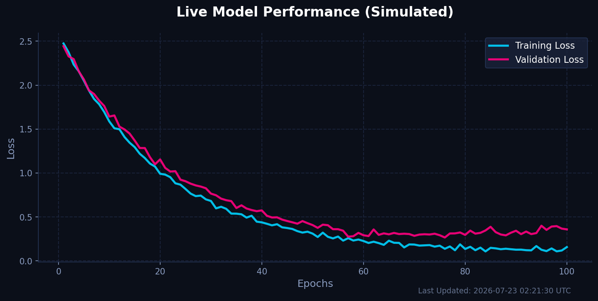

<!-- =======================================================
     JAW-DROPPING GITHUB PROFILE README
     Data Science & Analytics Dashboard
======================================================== -->

<!-- Hero Dashboard Glassmorphism SVG -->

 

  

<!-- BENTO GRID LAYOUT START -->
<table align="center" width="900" border="0" style="border-collapse: collapse;">
  <tr>
    <td width="50%" valign="top">
      <h2>🧠 About Me</h2>
      
I'm <b>Muhammed Ali</b>, a Data Analyst and Data Engineer. I transform complex datasets into actionable insights using robust architectures, optimized SQL, statistical modeling, and data visualization.

      
My focus is on making data pipelines <b>scalable, performant, and secure.</b>

       
      <h3>⚡ Professional Focus</h3>
      <ul>
        <li>Data Visualization & Storytelling</li>
        <li>Data Engineering & Pipeline Automation</li>
        <li>Analytics Engineering & BI</li>
        <li>Cloud Architecture & Pipelines</li>
      </ul>
    </td>
    <td width="50%" valign="top">
      <h2>📈 Live Model Performance (Auto-updated)</h2>
      
<i>Generated daily by my custom GitHub Action Python script.</i>

      
    </td>
  </tr>
  <tr>
    <td width="100%" colspan="2" valign="top">
      

      <h2>⚙️ The Tech Stack</h2>
    </td>
  </tr>
  <tr>
    <td width="50%" valign="top">
      <h3>AI, Data Science & Vibe Coding</h3>
      

        
        
        
        
        
        
        
        
        
      

      <h3>Big Data & Pipelines</h3>
      

        
        
        
        
        
      

    </td>
    <td width="50%" valign="top">
      <h3>Languages & Databases</h3>
      

        
      

      <h3>Google Cloud & DevOps</h3>
      

        
      

    </td>
  </tr>
</table>
<!-- BENTO GRID LAYOUT END -->

---

  <h2>🚀 Featured Projects</h2>

<table align="center" width="900" border="0" style="border-collapse: collapse;">
  <tr>
    <td width="50%" valign="top">
      <h3>🏢 Enterprise SQL Analytics</h3>
      
Production-inspired SQL analytics platform demonstrating dimensional modeling and interactive reporting.

      
    </td>
    <td width="50%" valign="top">
      <h3>🏗 SQL Data Warehouse</h3>
      
Complete implementation demonstrating ETL pipelines, star schemas, and analytical reporting models.

      
    </td>
  </tr>
  <tr>
    <td width="50%" valign="top">
      <h3>🌍 Universal Data Analysis Tool</h3>
      
Automates dataset exploration, preprocessing, and statistical analysis to extract instant insights.

      
    </td>
    <td width="50%" valign="top">
      <h3>🔍 Duplicate Item Detection</h3>
      
Record matching and duplicate detection for maintaining pristine enterprise datasets.

      
    </td>
  </tr>
</table>

---

  <h2>📊 Advanced GitHub Metrics</h2>
  
<i>Generated by GitHub Actions (Metrics Plugin)</i>

  
  
  
    
  
  

---

  <i>"Data is the new oil, but without intelligent architecture and rigorous modeling, it remains unrefined."</i> 
   
  

